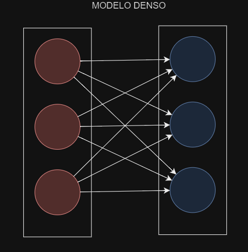

# Conversor de Temperatura con TensorFlow

Este proyecto utiliza TensorFlow para entrenar un modelo de red neuronal que convierte temperaturas de grados Celsius a Fahrenheit. Se proporciona un conjunto de datos de entrenamiento con pares de valores de temperatura en Celsius y Fahrenheit, y el modelo aprende a realizar la conversión.

## Requisitos

- Python 3.x
- TensorFlow
- NumPy
- Matplotlib

## Instalación

1. Instala las dependencias utilizando el siguiente comando:

    ```bash
    pip install tensorflow numpy matplotlib
    ```

2. Ejecuta el script `conversor_temperatura.py` para entrenar el modelo y realizar una predicción.

## Código

El código principal está en el archivo `conversor_temperatura.py`. Aquí se define y entrena el modelo de red neuronal para realizar la conversión de temperaturas.

```python
import tensorflow as tf
import numpy as np
import matplotlib.pyplot as plt


# Definición del modelo
oculta1 = tf.keras.layers.Dense(units=3, input_shape=[1])
oculta2 = tf.keras.layers.Dense(units=3)
salida = tf.keras.layers.Dense(units=1)
modelo = tf.keras.Sequential([oculta1, oculta2, salida])

# Compilación del modelo
modelo.compile(
    optimizer=tf.keras.optimizers.Adam(0.1),
    loss='mean_squared_error'
)

# Entrenamiento del modelo
historial = modelo.fit(celsius, fahrenheit, epochs=1000, verbose=False)
```
<div style="text-align:center"></div>